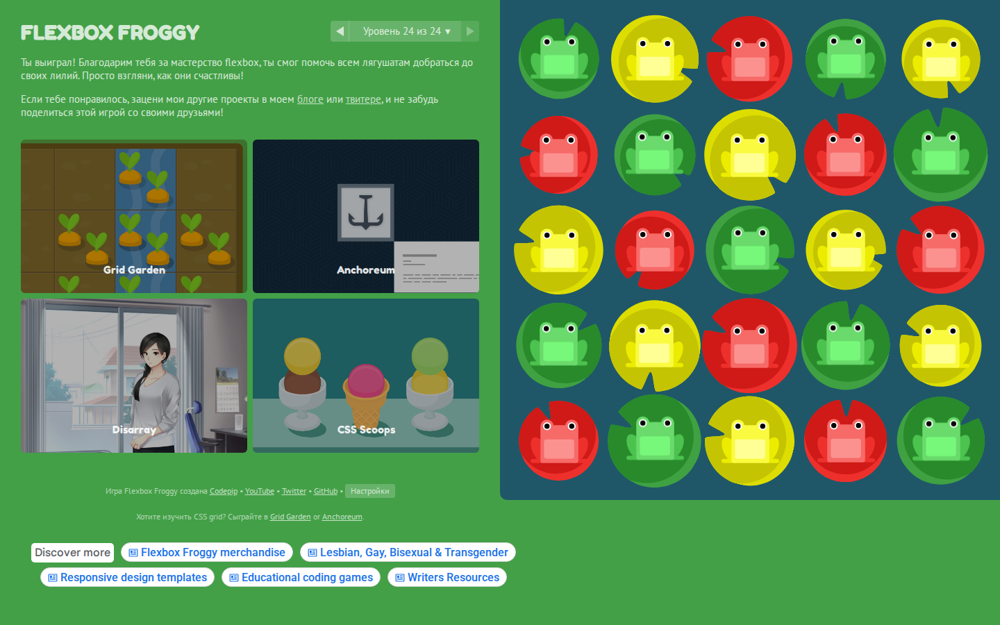
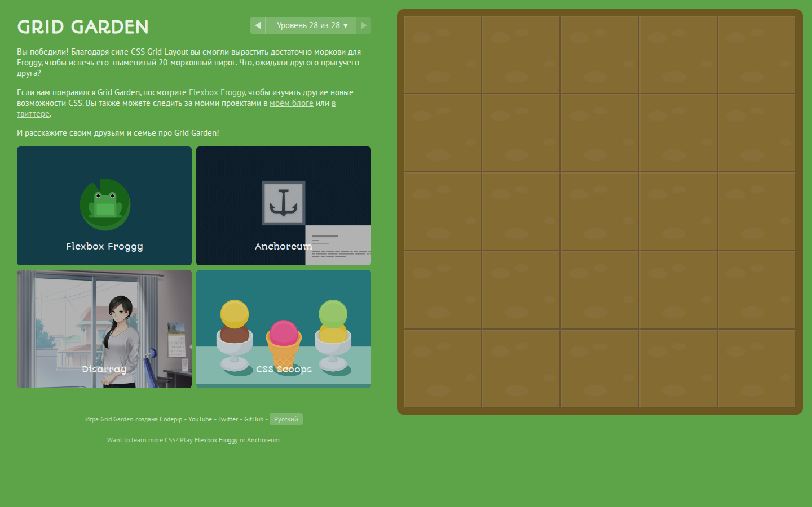
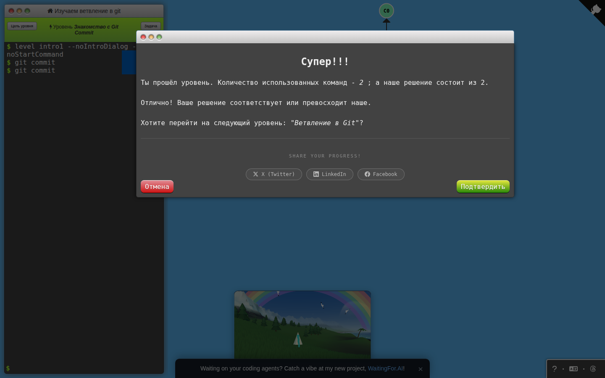
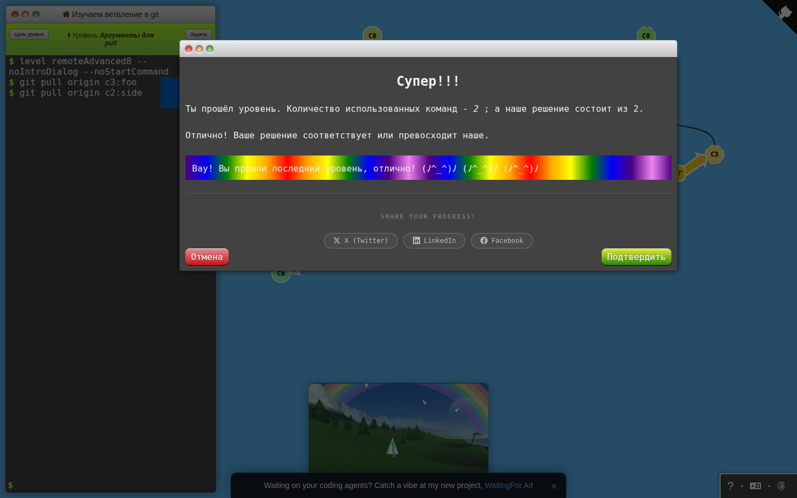

# Университет ИТМО

**Дисциплина:** фронт-энд разработка

**Домашняя работа № 1:** CSS Flexbox, CSS Grid и основы Git

**Выполнил:** Макаров Егор

**Группа:** К3440

**Преподаватель:** Добряков Д. И.

**Санкт-Петербург, 2026**

## Задача

Пройти Flexbox Froggy и CSS Grid Garden полностью, а в Learn Git Branching — первые четыре урока основ и все уроки работы с удалёнными репозиториями. Структура отчёта адаптирована из шаблона курса: сведения о работе, задача, ход работы и вывод. По выбранному формату сдачи отчёт подготовлен в Markdown, без PDF.[1] [2]

## Результат

| Тренажёр | Требуемые уровни | Фактический результат | Машиночитаемый журнал |
|---|---|---|---|
| Flexbox Froggy | 1–24 | 24/24 приняты штатным проверяющим механизмом | [flexbox-froggy-results.json](evidence/flexbox-froggy-results.json) |
| CSS Grid Garden | 1–28 | 28/28 приняты штатным проверяющим механизмом | [grid-garden-results.json](evidence/grid-garden-results.json) |
| Learn Git Branching: основы | `intro1`–`intro4` | 4/4, отображён диалог «Ты прошёл уровень» | [git-results.json](evidence/git-results.json) |
| Learn Git Branching: Remote | `remote1`–`remote8`, `remoteAdvanced1`–`remoteAdvanced8` | Все 16 уроков, отображён диалог успешного прохождения каждого | [git-results.json](evidence/git-results.json) |

Проверки выполнены 24 сентября 2026 года. Полные CSS-ответы сохранены в [solutions/css.json](solutions/css.json), команды Git и текст подтверждения — в журнале Git. [SOLUTIONS.md](SOLUTIONS.md) представляет эти же ответы в удобном для чтения виде.

## Ход работы

### Flexbox Froggy

В тренажёре последовательно применены выравнивание по главной и поперечной осям, смена направления, порядок отдельных элементов, перенос строк и выравнивание многострочного контейнера.[3] Решение последнего уровня объединяет `flex-flow: column-reverse wrap-reverse`, `justify-content: center` и `align-content: space-between`.

Для каждого уровня CSS вводился в штатное поле `#code`. После события ввода проверялось, что встроенный механизм активировал кнопку перехода. Переход к следующему уровню выполнялся только этой кнопкой. Каждый принятый ответ, номер уровня и время проверки записаны в журнал. Значения прогресса в `localStorage` и внутренние переменные игры скриптом не изменялись.



[Последний уровень с введённым CSS](screenshots/flexbox-froggy-last-level.png) позволяет сопоставить решение с результатом размещения элементов.

### CSS Grid Garden

Уровни охватывают линии и области сетки, отрицательные индексы, `span`, `order`, дробные единицы `fr`, повторяемые шаблоны и сокращённую запись `grid-template`.[4] В задаче 26 использовано `grid-template-rows: 50px 0 0 0 1fr`, чтобы выделить требуемый первый ряд и отдать оставшееся пространство последнему. В задаче 28 используется `grid-template: 1fr 50px / 1fr 4fr`.

Проверка выполнялась аналогично Flexbox Froggy: ввод CSS, положительный ответ встроенного проверяющего механизма, штатная кнопка перехода. Сохранён журнал всех 28 уровней, а не только изображение последнего экрана.



[Решение последнего уровня](screenshots/grid-garden-last-level.png) показывает размещение рядов и колонок.

### Learn Git Branching

В основной части выполнены создание коммитов, ветвление, слияние и перенос коммитов через rebase. В Remote-части выполнены клонирование, работа с remote-tracking branches, fetch, pull, push, объединение разошедшейся истории, настройка upstream и расширенные refspec для push/fetch/pull.[5]

Публичная страница игры в используемом окружении загружала ресурсы неполностью. Поэтому для проверки использована локальная копия **официального открытого проекта**, зафиксированная на коммите `20dfff09e59e42ddc8fbd5dc722e8ddddeb43418`.[6] В ней изменена только настройка разрешённого hostname Vite для доступа к серверу. Файлы уровней, Git-движок и проверка целевого графа не изменялись.

Команды для воспроизводимого прогона сопоставлены с открытыми определениями уровней и вводились в видимый терминал игры. Принимающим условием служил настоящий диалог «Ты прошёл уровень», создаваемый игрой после сравнения полученного графа с целью. Вызовы внутреннего API для принудительного выставления прогресса и команда показа готового решения не использовались. Параметры `--noIntroDialog` и `--noStartCommand` отключали только вводные слайды и автоматически выводимую подсказку; они не заменяли выполнение Git-команд.

Ввод автоматизирован Playwright. Это обеспечивает повторяемость проверки, но не подменяет её: для каждого из 20 обязательных Git-уроков сохранены реально введённые команды, штатное сообщение checker и отдельный снимок экрана.





Все остальные снимки доступны в [screenshots/git](screenshots/git).

## Воспроизведение

Требуется Node.js 22 и npm. Из корня клонированного репозитория:

```bash
cd "homeworks/К3440/Макаров Егор/hw1"
npm ci
npx playwright install chromium
npm run test:css
```

На Linux Playwright может потребовать системные библиотеки Chromium; их установка описана в официальной документации.[7] Команда `npm run test:css` открывает реальные публичные сайты в новых браузерных контекстах, поэтому требует доступа в интернет. Она не загружает заранее подготовленное состояние прохождения.

Для Git-тренажёра в отдельном терминале запускается официальный проект:

```bash
git clone https://github.com/pcottle/learnGitBranching.git /tmp/learn-git-branching
git -C /tmp/learn-git-branching checkout 20dfff09e59e42ddc8fbd5dc722e8ddddeb43418
cd /tmp/learn-git-branching
corepack yarn install --frozen-lockfile
corepack yarn dev --host 127.0.0.1 --port 4180 --strictPort
```

Затем из каталога `hw1`:

```bash
npm run test:git -- /tmp/learn-git-branching
```

Сценарий использует штатный UI локального тренажёра и сохраняет результаты в `evidence` и `screenshots/git`. Повторный прогон обновляет эти файлы актуальными результатами. URL другого локального сервера можно передать последним аргументом.

Исходники автоматизации: [verify-css.mjs](scripts/verify-css.mjs) и [verify-git.mjs](scripts/verify-git.mjs). Также сохранены варианты CSS-сценариев для консоли страницы: [Flexbox Froggy](flexbox-froggy-playthrough.js) и [CSS Grid Garden](grid-garden-playthrough.js). Перед их запуском нужный первый уровень выбирается через обычное меню игры.

## Вывод

Выполнен весь требуемый объём ДЗ1: Flexbox Froggy, CSS Grid Garden, четыре вводных Git-урока и обе группы Remote. На практике проверены различия между главной и поперечной осями Flexbox, размещение элементов в двумерной Grid-сетке и преобразования истории Git при локальной и удалённой работе. Результат подтверждается не только скриншотами, но и воспроизводимыми сценариями и журналом принятия каждого уровня.

## Источники

[1]: https://github.com/Makarov1e/ITMO-ACS-Frontend-2026 "Условия курса по фронтенду ИТМО"
[2]: https://docs.google.com/document/d/1zgXRYAh9iO21NDcp5Cua3mOiNRWbAVZJBfgGiqGsMsU/edit "Шаблон отчёта курса"
[3]: https://flexboxfroggy.com/#ru "Flexbox Froggy"
[4]: https://cssgridgarden.com/#ru "CSS Grid Garden"
[5]: https://learngitbranching.js.org/?locale=ru_RU "Learn Git Branching"
[6]: https://github.com/pcottle/learnGitBranching/tree/20dfff09e59e42ddc8fbd5dc722e8ddddeb43418 "Официальный исходный код Learn Git Branching, зафиксированная версия"
[7]: https://playwright.dev/docs/browsers "Playwright — установка браузеров и системных зависимостей"
