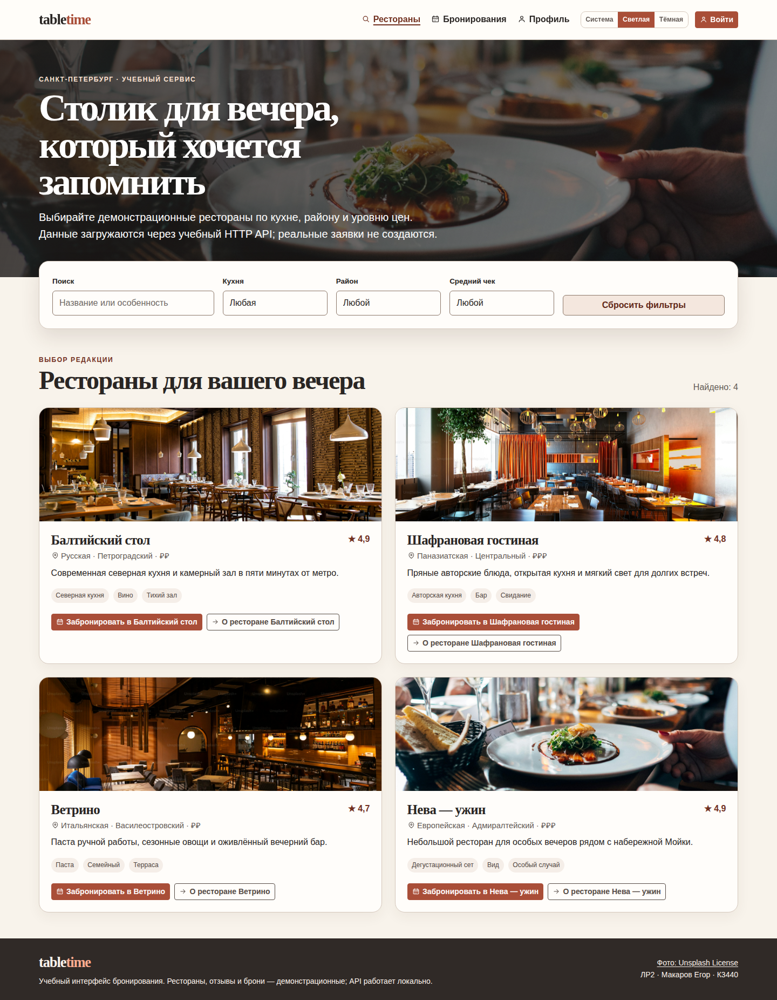
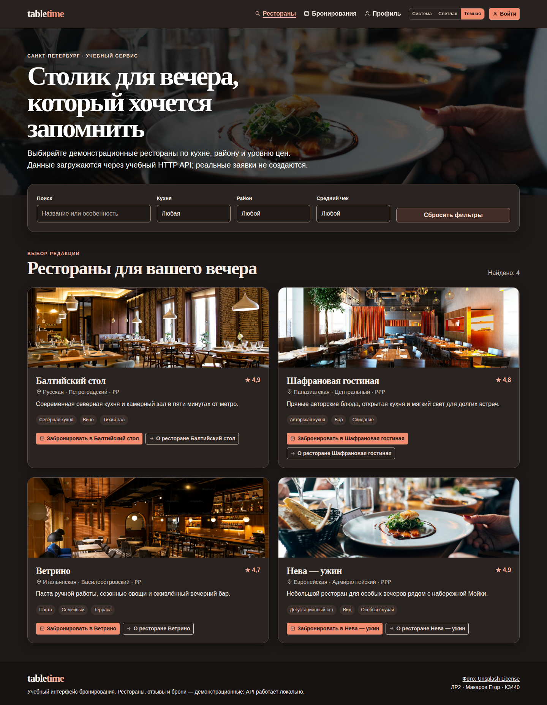
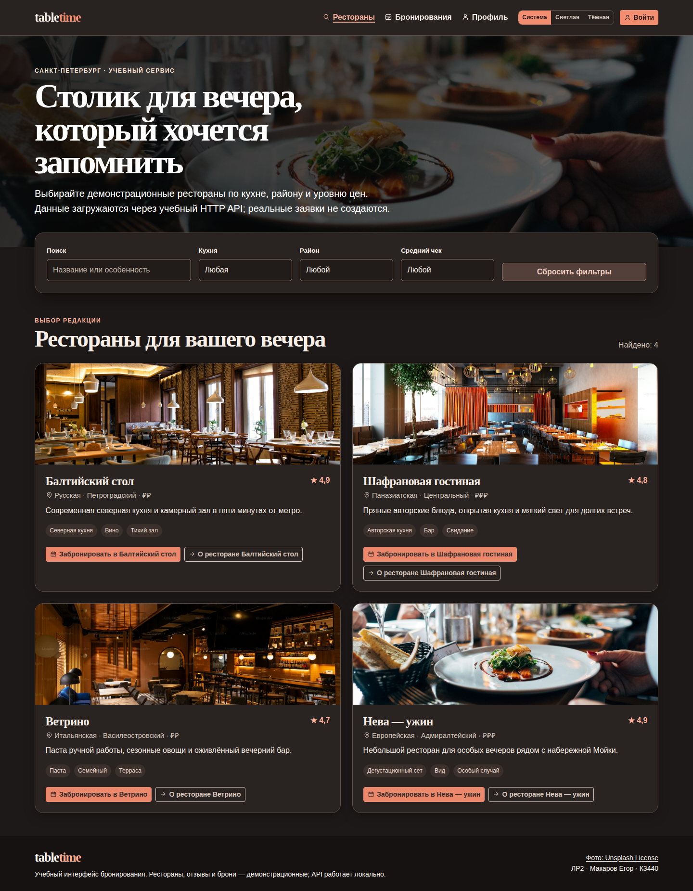

# Домашняя работа 3. CSS-переменные и темизация TableTime

**Студент:** Макаров Егор
**Группа:** К3440
**Вариант:** бронирование столиков в ресторанах
**Базовая работа:** ЛР2 — TableTime

## Цель

Улучшить ранее реализованный интерфейс TableTime с помощью CSS-переменных и добавить светлую, тёмную и системную темы. Выбор пользователя должен быть доступен с клавиатуры, сохраняться между сессиями браузера и не ухудшать читаемость интерфейса.

## Реализация

В ЛР2 добавлен модуль [`theme.js`](../../../../labs/К3440/Макаров%20Егор/lab2/src/theme.js). Он хранит пользовательский выбор в `localStorage` по ключу `tabletime.theme`, принимает только значения `system`, `light` и `dark`, а затем устанавливает на корневом элементе атрибуты `data-theme` и `data-theme-preference`. Ошибка доступа к хранилищу не прерывает работу: настройка сохраняется только до закрытия вкладки.

Режим **«Система»** является начальным при отсутствии корректного сохранённого значения. Он использует `matchMedia('(prefers-color-scheme: dark)')` для определения фактической палитры и подписывается на событие `change`. Поэтому изменение системной настройки во время открытой страницы немедленно меняет палитру, пока пользователь не выбрал светлый или тёмный режим вручную. Медиа-функция `prefers-color-scheme` определяет запрошенную пользователем светлую или тёмную цветовую схему [2], а событие `change` у `MediaQueryList` срабатывает при изменении соответствия запросу [3].

Палитра ЛР2 переведена на семантические CSS-переменные в [`styles.css`](../../../../labs/К3440/Макаров%20Егор/lab2/src/styles.css): отдельные переменные определяют фон, поверхность, основной и вторичный текст, границы, поля, акцент, фокус, уведомления и состояние ошибки. CSS custom properties участвуют в каскаде и используются через `var()`, что позволяет заменить значения палитры без дублирования правил компонентов [1]. Для `html[data-theme="dark"]` переопределены те же семантические токены. Также задано свойство `color-scheme`, поэтому нативные элементы браузера согласованы с активной темой.

Переключатель **«Система / Светлая / Тёмная»** добавлен в общую навигацию всех страниц. Это группа нативных radio-кнопок с визуально видимыми подписями, скрытым заголовком `legend` «Оформление», отчётом об активном состоянии через `aria-live` и заметным `:focus-visible`. Элементы доступны мышью, клавиатурой и программам чтения с экрана. В светлой и тёмной темах проверен коэффициент контраста основных текста, полей и контурной кнопки: каждый не ниже 4.5:1.

Выбранная настройка записывается в `localStorage`; этот объект хранит данные для origin между браузерными сессиями [4]. Переключатель не изменяет API, бронирования или данные профиля ЛР2.

## Интеграционные файлы

| Файл | Назначение |
|---|---|
| [`src/theme.js`](../../../../labs/К3440/Макаров%20Егор/lab2/src/theme.js) | Контроллер выбора, хранения и применения темы; обработчик изменения системной темы. |
| [`src/app.js`](../../../../labs/К3440/Макаров%20Егор/lab2/src/app.js) | Создание контроллера и монтирование доступного переключателя в общий header. |
| [`src/styles.css`](../../../../labs/К3440/Макаров%20Егор/lab2/src/styles.css) | Семантические токены, значения светлой и тёмной палитр, стили переключателя и доступные состояния. |
| [`tests/theme.e2e.test.mjs`](../../../../labs/К3440/Макаров%20Егор/lab2/tests/theme.e2e.test.mjs) | Проверка сохранения, `system`, live-реакции, контраста и клавиатурного фокуса. |
| [`package.json`](../../../../labs/К3440/Макаров%20Егор/lab2/package.json) | Команда `npm run test:theme`. |

## Воспроизводимый patch

Для самостоятельного переноса изменения приложен [`lab2-theme.patch`](lab2-theme.patch). Он создан командой `git --no-pager diff --no-color --cached --no-ext-diff --binary` из отдельного временного индекса, поэтому не содержит ANSI-последовательностей и не зависит от содержимого основного индекса. Его точный baseline — commit `a9a62cf53aa13320e8df4a363e28b7ba8a8e4b1e` (`docs(lab1): add verification report and smoke test`): это состояние ветки **до** commit с темизацией, но уже **после** commit `5221262` со sprite ЛР2. Временное worktree, созданное на этом baseline, успешно прошло `git apply --check lab2-theme.patch`.

Patch изменяет только `package.json`, `src/app.js`, `src/styles.css`, а также добавляет `src/theme.js` и `tests/theme.e2e.test.mjs`. Он намеренно не затрагивает уже существующие [`assets/icons.svg`](../../../../labs/К3440/Макаров%20Егор/lab2/assets/icons.svg) и файлы SVG-sprite: их нельзя удалять или переносить повторно. После применения patch следует выполнить команды проверки из следующего раздела. Проверка patch поверх текущего рабочего дерева ЛР2 не является корректной: тематические изменения там уже зафиксированы.

## Запуск

Исходники ЛР2 самостоятельны и находятся в `labs/К3440/Макаров Егор/lab2`. Для установки зависимостей используется `npm ci`. Далее в отдельном терминале запускается `npm run dev`; web-интерфейс доступен на `http://127.0.0.1:5172`, а учебный JSON Server — на `http://127.0.0.1:3002`.

```bash
# Выполнить из корня клонированного репозитория:
cd "labs/К3440/Макаров Егор/lab2"
npm ci
npm run dev
```

Проверка тематизации запускается отдельно:

```bash
npm run test:theme
```

При финализации этой работы сценарий проверки в изолированной временной директории собрал production-версию, выполнил `npm run test:theme`, создал patch без цвета и проверил его применение к указанному baseline. Генерируемый `dist/` игнорируется Git.

## Проверки и результаты

Проверки выполнены 24.09.2026 в рабочем окружении. Команды ниже завершились с кодом 0; скриншоты созданы настоящим Chromium/Playwright-тестом, а не графическим редактором.

| Команда | Результат |
|---|---|
| `git --no-pager diff --no-color --check` | Успешно: ошибок пробелов нет. Patch создан без ANSI и прошёл `git apply --check` в отдельном worktree на `a9a62cf53aa13320e8df4a363e28b7ba8a8e4b1e`. |
| `npm run build` | Успешно: Vite собрал 6 HTML-точек входа и ресурсы. Артефакты `dist/` проигнорированы Git. |
| `npm run test:theme` | Успешно: 2 из 2. Проверены переключение светлой/тёмной темы, `localStorage`, reload, режим system, изменение system light↔dark, контраст и фокус. |
| `npm run test` | Успешно: 7 из 7 API-тестов ЛР2. |
| `npm run test:a11y` | Успешно: 3 из 3 проверок семантики, подписей, skip-link и диалога. |
| `npm run test:e2e` | Успешно: 2 из 2 — вход, создание, изменение и отмена брони, redirect гостя. |

## Скриншоты

Скриншоты получены Playwright из отображённого интерфейса при разрешении 1440×1000. На них видны карточки ресторанов, фильтры и переключатель в навигации.

### Явно выбранная светлая тема



### Явно выбранная тёмная тема



### Режим «Система» при тёмном системном предпочтении



## Ограничения

Темы проверены автоматизированным Chromium/Playwright. Firefox DevTools не использовался для этой работы: требование ДЗ3 охватывает CSS-переменные и темизацию, а не ручную проверку доступности из ДЗ2. Учебный API остаётся локальным; рестораны и бронирования демонстрационные. Изображения ресторанов были добавлены ранее в ЛР2; их происхождение и условия использования указаны в footer интерфейса как Unsplash License.

## Вывод

TableTime теперь использует единый набор семантических CSS-переменных, поддерживает светлую, тёмную и системную темы, сохраняет явный пользовательский выбор и реагирует на изменение системной цветовой схемы в режиме «Система». Функциональность ЛР2 и её автоматические проверки сохранены.

## Источники

[1]: https://developer.mozilla.org/en-US/docs/Web/CSS/Reference/Properties/--* "Custom properties (--*): CSS variables — MDN Web Docs"
[2]: https://developer.mozilla.org/en-US/docs/Web/CSS/Reference/At-rules/@media/prefers-color-scheme "prefers-color-scheme — MDN Web Docs"
[3]: https://developer.mozilla.org/en-US/docs/Web/API/MediaQueryList/change_event "MediaQueryList: change event — MDN Web Docs"
[4]: https://developer.mozilla.org/en-US/docs/Web/API/Window/localStorage "Window: localStorage property — MDN Web Docs"
