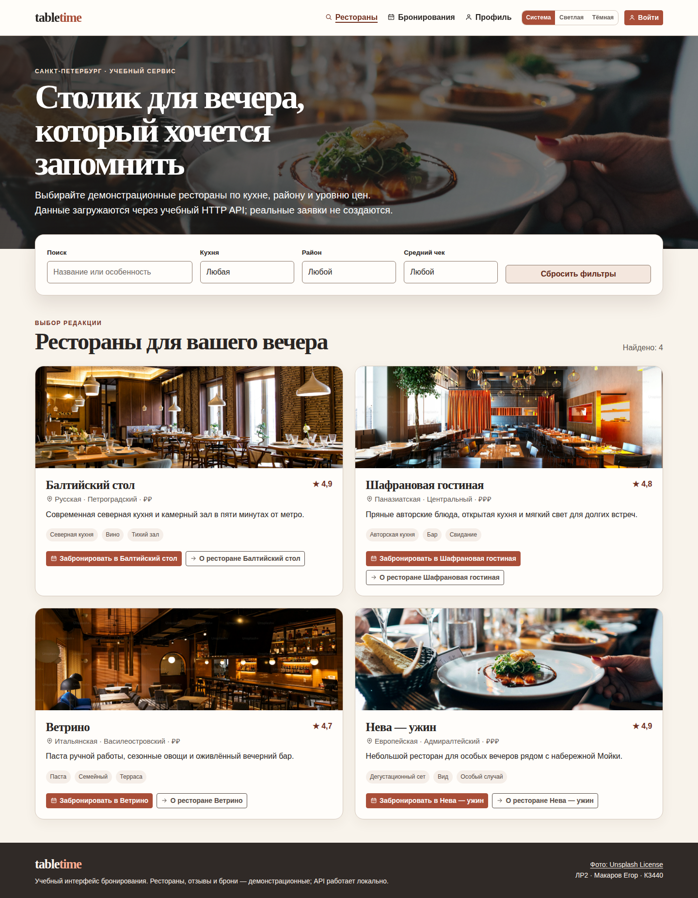
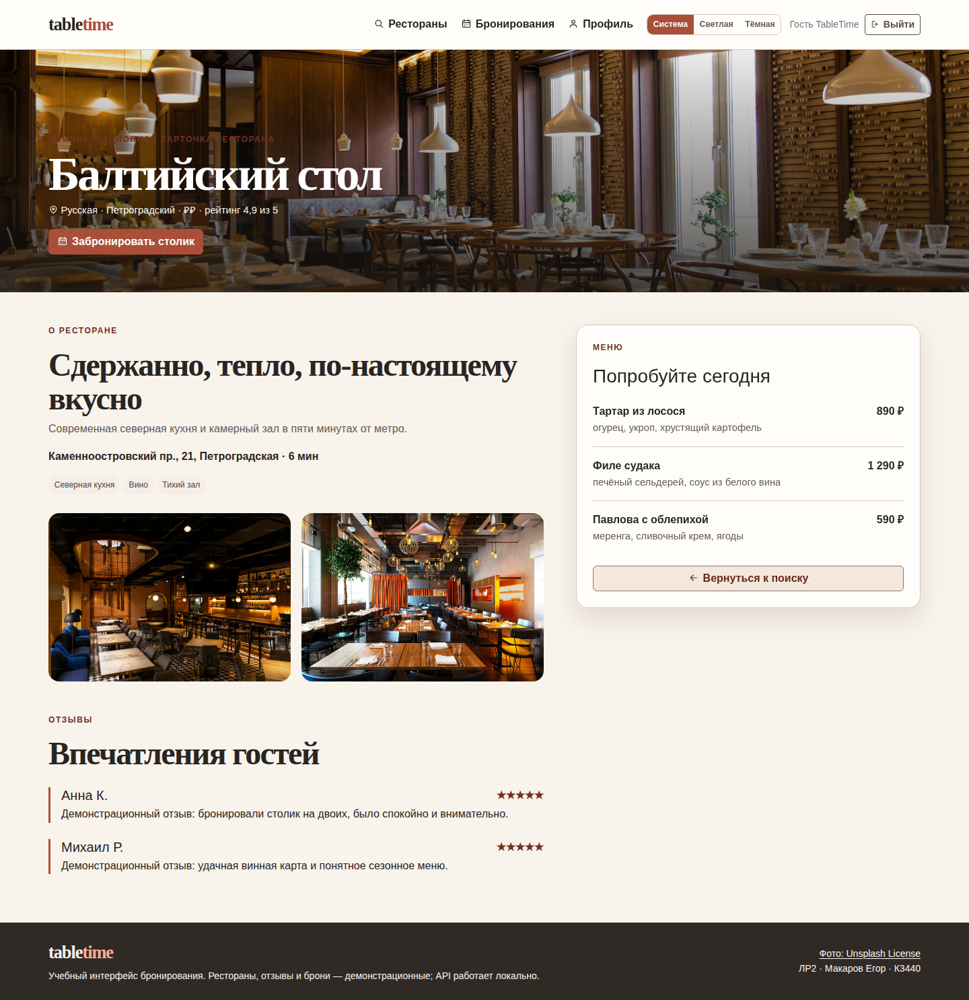

# Домашняя работа 4. SVG-спрайт TableTime

**Студент:** Макаров Егор
**Группа:** К3440
**Вариант:** бронирование столиков в ресторанах
**Базовая работа:** ЛР2 — TableTime

## Цель

Вынести используемые в интерфейсе TableTime векторные пиктограммы в единый SVG-спрайт и повторно выводить их через `symbol`/`use`. Решение должно сохранять цветовую адаптацию и не добавлять декоративные изображения в дерево доступности.

## Результат

Реализация добавлена отдельным code-коммитом `5221262523bd549b8609ad45bcf4b05ffba4a3b2` (`feat(hw4): add reusable TableTime SVG sprite`). В нём в ЛР2 появился единый спрайт, модуль его монтирования, стили и сквозной Playwright-тест. Для проверки и переноса к этой работе приложена точная каноническая копия [`icons.svg`](icons.svg). Её SHA-256: `9de890cf4e6751393d8ca273f3fd1a508c5fc268b3c12752f9cfe201f775bfb1`; источник копии — [интегрированный файл ЛР2](../../../../labs/К3440/Макаров%20Егор/lab2/assets/icons.svg).

Спрайт содержит семь используемых символов: `search`, `calendar`, `user`, `logout`, `pin`, `arrow-right` и `arrow-left`. Это больше минимальных 3–5 иконок из задания. Согласно справке MDN, `<symbol>` задаёт шаблон графического объекта, а экземпляр выводится ссылкой `<use>`; именно эта схема применена здесь [1] [2].

## Интеграция

| Файл | Назначение |
|---|---|
| [`icons.svg`](icons.svg) | Каноническая приложенная копия общего sprite: семь `<symbol id="icon-*">` с `viewBox="0 0 24 24`. |
| [`assets/icons.svg`](../../../../labs/К3440/Макаров%20Егор/lab2/assets/icons.svg) | Файл, который Vite импортирует в работающую ЛР2 как raw-разметку. |
| [`src/sprite-icons.js`](../../../../labs/К3440/Макаров%20Егор/lab2/src/sprite-icons.js) | Однократно помещает sprite в скрытый контейнер `#tt-svg-sprite`, формирует `<svg><use href="#icon-*"></use></svg>` и добавляет пиктограммы к существующим ссылкам, карточкам и кнопкам. |
| [`src/sprite-icons.css`](../../../../labs/К3440/Макаров%20Егор/lab2/src/sprite-icons.css) | Задаёт размер `1em`, выравнивание, `stroke: currentColor` и `color: currentColor`; цвет значка наследуется от текста/контрола. |
| [`src/app.js`](../../../../labs/К3440/Макаров%20Егор/lab2/src/app.js) | Импортирует модуль sprite при запуске всех страниц ЛР2. |
| [`tests/sprite.e2e.test.mjs`](../../../../labs/К3440/Макаров%20Егор/lab2/tests/sprite.e2e.test.mjs) | Запускает Playwright-проверку структуры, видимости и доступности, а также сохраняет evidence. |
| [`package.json`](../../../../labs/К3440/Макаров%20Егор/lab2/package.json) | Определяет команду `npm run test:sprite`. |

### `use`, цвет и доступность

Каждый отображаемый экземпляр создаётся в [`iconMarkup`](../../../../labs/К3440/Макаров%20Егор/lab2/src/sprite-icons.js) как `<svg class="tt-icon …" aria-hidden="true" focusable="false" viewBox="0 0 24 24"><use href="#icon-name"></use></svg>`. Атрибут `href` выбирает конкретный `symbol`; `<use>` дублирует узел, на который ссылается фрагмент URL [2]. Таким образом, геометрия каждой иконки определена один раз, а не повторяется в HTML.

У контуров внутри [`icons.svg`](icons.svg) явно задан `stroke="currentColor"`; для оболочки в [`sprite-icons.css`](../../../../labs/К3440/Макаров%20Егор/lab2/src/sprite-icons.css) также установлены `color: currentColor` и `stroke: currentColor`. Поэтому пиктограмма принимает текущий цвет родительской ссылки или кнопки, включая состояния интерфейса и тему, без набора отдельных цветных SVG-файлов.

Все добавляемые пиктограммы декоративны: смысл элемента сообщается видимым текстом ссылки, кнопки либо метаданными карточки. По этой причине у внешнего `<svg>` стоят `aria-hidden="true"` и `focusable="false"`; скрытый контейнер со sprite также имеет `aria-hidden="true"`. `aria-hidden="true"` исключает неинтерактивное декоративное содержимое из дерева доступности и не должен применяться к фокусируемым объектам [3]. В данной реализации фокус остаётся на ссылках и кнопках, а не на SVG. Доступное имя управляющего элемента не подменяется названием иконки.

## Запуск и проверка

ЛР2 является самостоятельным учебным приложением. Для чистого запуска используются следующие команды; API слушает `127.0.0.1:3002`, веб-интерфейс — `http://127.0.0.1:5172`.

```bash
# Выполнить из корня клонированного репозитория:
cd "labs/К3440/Макаров Егор/lab2"
npm ci
npm run dev
```

Проверка спрайта не требует полного набора тестов и сама поднимает нужные процессы, если они не запущены:

```bash
# Выполнить из корня клонированного репозитория:
cd "labs/К3440/Макаров Егор/lab2"
npm run test:sprite
```

Сквозной сценарий проверяет, что на поисковой странице отображаются `search`, `calendar`, `user`, `pin` и `arrow-right`; после демо-входа появляется `logout`; на карточке ресторана отображаются `logout`, `pin`, `calendar` и `arrow-left`. Дополнительно он подтверждает все семь `<symbol>`, использование `currentColor`, наличие `aria-hidden="true"` и `focusable="false"`, а затем сохраняет два скриншота.

## Скриншоты

Снимки созданы Playwright-тестом из фактически отображённой ЛР2 при ширине 1440 px. Они не являются макетами.

### Поиск ресторанов и карточки



### Страница ресторана после демо-входа



## Проверки и ограничения

Повторно выполненная для этой работы команда `npm run test:sprite` завершилась с кодом 0: **1 из 1** тестов. Тест запускает Chromium через Playwright, проверяет DOM и сохраняет приведённые выше screenshots. В рамках этой домашней работы намеренно не повторялись установка зависимостей и полный набор тестов ЛР2.

Спрайт расположен внутри HTML-документа через raw-импорт Vite, а не запрашивается с внешнего домена. Изображения ресторанов, учётные данные и бронирования остаются демонстрационными данными ЛР2; ДЗ4 их не изменяет.

## Вывод

TableTime использует один SVG-спрайт из семи семантически названных символов. Пиктограммы переиспользуются через `use`, наследуют цвет интерфейса посредством `currentColor` и не создают дублирующего шума для программ чтения с экрана. Канонический sprite, исходники интеграции, автоматическая проверка и реальные screenshots приложены по ссылкам выше.

## Источники

[1]: https://developer.mozilla.org/en-US/docs/Web/SVG/Reference/Element/symbol "<symbol> — SVG — MDN Web Docs"
[2]: https://developer.mozilla.org/en-US/docs/Web/SVG/Reference/Element/use "<use> — SVG — MDN Web Docs"
[3]: https://developer.mozilla.org/en-US/docs/Web/Accessibility/ARIA/Reference/Attributes/aria-hidden "ARIA: aria-hidden attribute — MDN Web Docs"
