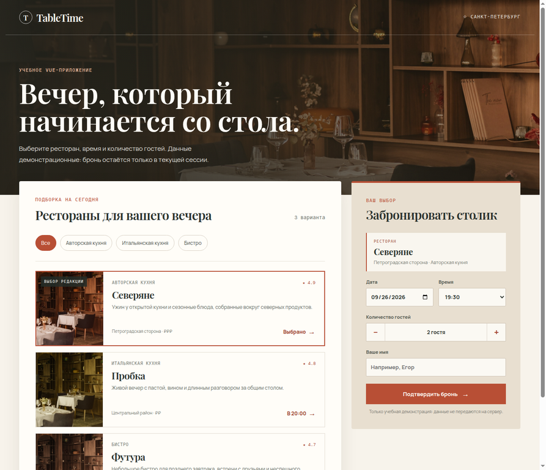
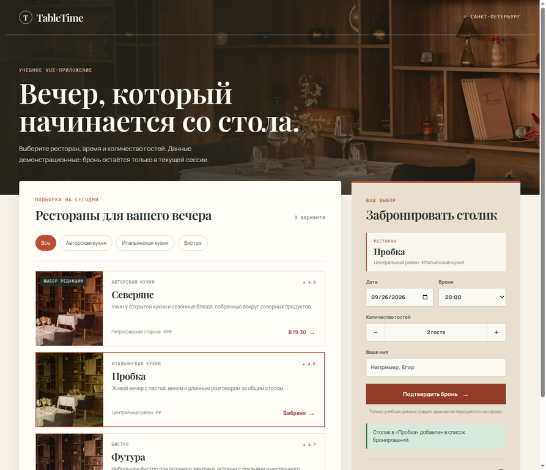

# Домашняя работа 5: Vue и npm — TableTime

**Студент:** Макаров Егор  
**Группа:** К3440  
**Тема:** основы npm и Vue 3

## Цель и итог

Цель работы — освоить базовые команды npm и собрать небольшое приложение на Vue по общему учебному мануалу курса. В результате создано автономное учебное приложение **TableTime**: оно выводит демонстрационный список ресторанов Санкт-Петербурга, фильтрует его по кухне, позволяет выбрать ресторан и создать бронь в пределах текущей вкладки. Данные и бронирования намеренно демонстрационные; они не отправляются на сервер.

Мануал курса по Vue был реально открыт и прочитан предыдущим исполнителем 24 сентября 2026 года. Реализация следует его базовой последовательности: проект с npm-зависимостями, Vue-приложение, компоненты, реактивные данные и запуск через Vite. Исходное задание ожидает код приложения и screenshots отображённых компонентов [1] [2].

## Реализация

Точкой входа служит [src/main.js](src/main.js), который монтирует приложение Vue. Конфигурация [vite.config.js](vite.config.js) подключает `@vitejs/plugin-vue`; в ней же задана среда `jsdom` для Vitest. Манифест [package.json](package.json) фиксирует команды разработки, сборки, тестирования и проверки адаптивности, а [package-lock.json](package-lock.json) делает установку воспроизводимой через `npm ci`.

Главный компонент [src/App.vue](src/App.vue) хранит три демонстрационных ресторана в `ref`, формирует доступные кухни и отфильтрованный список через `computed`, отслеживает выбранный ресторан и массив созданных броней. После события дочерней формы новая бронь добавляется в начало списка, а пользователю показывается сообщение со статусом.

Компонент [src/components/RestaurantCard.vue](src/components/RestaurantCard.vue) принимает объект `restaurant` и состояние `selected` через `props`. По нажатию он передаёт выбранный объект наверх через событие `select`. Компонент [src/components/BookingForm.vue](src/components/BookingForm.vue) получает выбранный ресторан как `prop`, использует `reactive` для полей формы и `computed` для проверки заполнения. Он изменяет число гостей в диапазоне от 1 до 8, подставляет доступное время при смене ресторана и испускает событие `create-booking` только при валидной форме. Это демонстрирует однонаправленную передачу данных вниз через props и коммуникацию вверх через emits.

Стили находятся в [src/styles.css](src/styles.css). Сценарий [scripts/check-responsive.mjs](scripts/check-responsive.mjs) запускает браузерную проверку на 1440×1000 и 375×812 пикселей: на обоих размерах должны быть видны заголовок, три карточки и панель формы; на мобильной ширине панели переходят в одну колонку.

## Запуск

Требуется совместимый Node.js и npm. В каталоге этой работы выполняются следующие команды:

```bash
npm ci
npm run dev
```

Команда `npm run dev` запускает Vite на `http://0.0.0.0:5175`. Для production-сборки используется `npm run build`; локальный просмотр результата доступен через `npm run preview`. Зависимости из `node_modules` и каталог `dist` не входят в репозиторий и игнорируются.

## Проверки

Автоматические тесты компонентов находятся в [src/components/components.spec.js](src/components/components.spec.js). Они подтверждают отображение props и событие `select` у карточки ресторана, а также реактивное изменение числа гостей и событие `create-booking` у формы. После обновления зависимостей успешно выполнены `npm ci`, `npm run build`, `npm test` (**2/2**) и `npm run test:responsive`: на desktop и mobile обнаружены три карточки и видимая форма.

Первичный `npm audit` выявил две moderate-уязвимости в цепочке Vitest 3.x (`@vitest/mocker`). Для устранения обновлён Vitest до **4.1.11**, совместимого с используемым Node.js 22.13.0, без смены версии Node. Одновременно `@vue/test-utils` закреплён на 2.4.6: его зависимость `js-beautify` 1.x использует совместимый с этой средой `nopt` 7.x вместо лишней ветки `nopt` 10.x, требующей более нового Node.js. После обновления `npm audit` сообщил **0 vulnerabilities**. Это изменение касается только инструментов разработки и не меняет функциональность приложения.

## Screenshots

Первый screenshot показывает исходно отображённые компоненты — каталог ресторанов и форму выбора: [vue-components-initial.webp](screenshots/vue-components-initial.webp). Второй показывает реактивный результат после заполнения формы и создания брони: [vue-booking-reactive.webp](screenshots/vue-booking-reactive.webp). Оба изображения имеют размер 893×768 пикселей и являются screenshots запущенного приложения, а не макетами.





## Ассеты и ограничения

В оформлении использована одна локальная фотография интерьера. Её происхождение, дата получения и условия использования описаны в [ASSETS.md](ASSETS.md); изображение не утверждает, что показывает конкретный ресторан из демонстрационного списка. Учебные названия ресторанов и описание сценариев также не являются предложением реальных услуг.

Приложение не содержит серверного API, авторизации, постоянного хранилища или реальной системы бронирования. Список броней существует только в оперативной памяти вкладки и исчезает после обновления страницы. Эти ограничения соответствуют цели ДЗ5 — отработать старт Vue-проекта, компоненты и npm-команды, а не реализовать полноценный сервис.

## Вывод

Работа демонстрирует создание Vue 3 приложения через npm и Vite, композицию из SFC-компонентов, реактивное состояние, вычисляемые значения и взаимодействие `props`/`emits`. Исходники, unit-тесты, сценарий адаптивной проверки и реальные screenshots находятся в одном воспроизводимом каталоге.

## References

[1]: https://docs.google.com/document/d/187UkgGNrcWqkb2aCGpkHTLgeozoElMqdVgVGMBOC9gk/edit?usp=sharing "Общий мануал курса по Vue.js"
[2]: https://github.com/kantegory/ITMO-ACS-Frontend-2026/blob/master/README.md "README курса: Домашняя работа 5"
[3]: https://vuejs.org/guide/introduction.html "Vue.js Guide: Introduction"
[4]: https://docs.npmjs.com/cli/v10/commands/npm-ci "npm CLI: npm ci"
