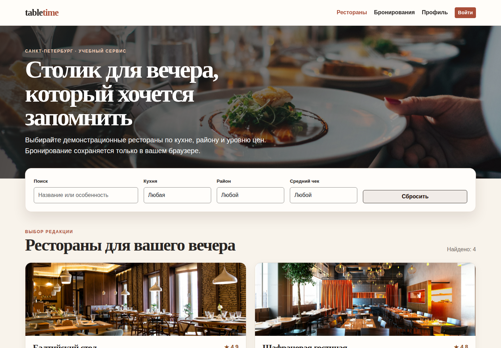
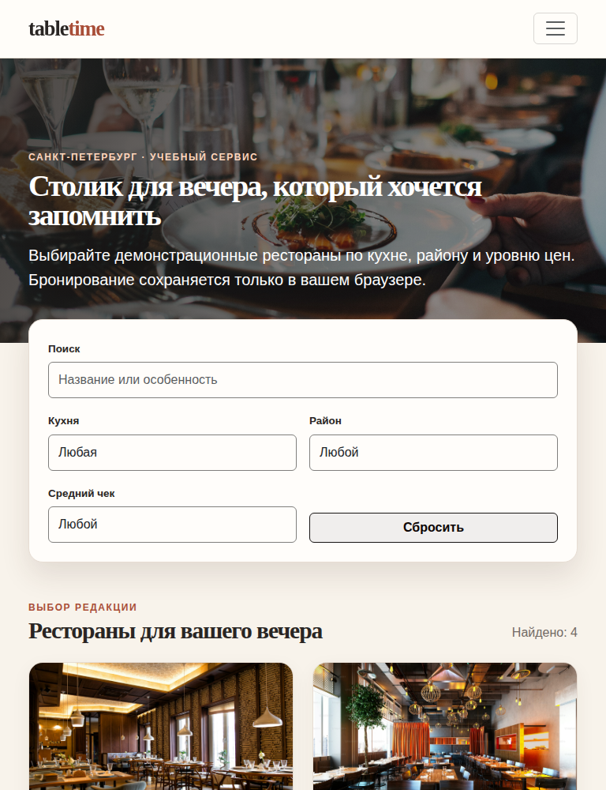
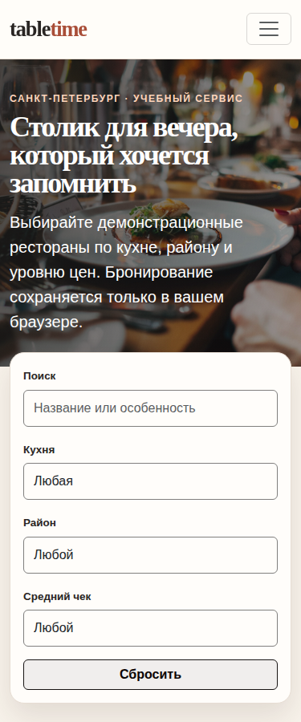
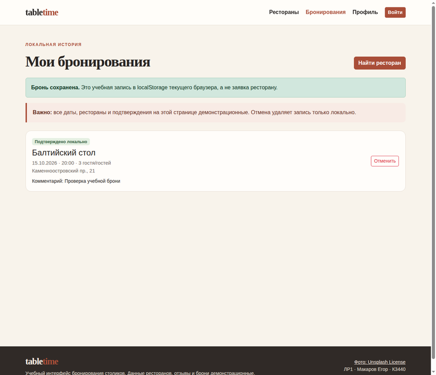

# Лабораторная работа 1 — TableTime

**Студент:** Макаров Егор

**Группа:** К3440

**Вариант:** приложение для бронирования столиков в ресторанах
**Дата проверки:** 24 сентября 2026 г.

## Цель работы

Сверстать адаптивный многостраничный интерфейс сервиса бронирования ресторанов **TableTime** средствами HTML, CSS, Bootstrap 5 и JavaScript. В качестве города выбран Санкт-Петербург. Работа выполняет вариант ЛР1 из [README курса](../../../../README.md): предусмотрены вход, регистрация, профиль, поиск ресторанов с фильтрами и страница ресторана, а также история бронирований.

## Реализация

Приложение является статическим многостраничным Vite-проектом, а не SPA и не React-приложением. Конфигурация [vite.config.js](vite.config.js) перечисляет шесть самостоятельных страниц: поиск ([index.html](index.html)), вход ([login.html](login.html)), регистрация ([register.html](register.html)), профиль ([profile.html](profile.html)), карточка ресторана ([restaurant.html](restaurant.html)) и история броней ([bookings.html](bookings.html)). Bootstrap подключён как локальная npm-зависимость; состав пакета и команды определены в [package.json](package.json).

Общий сценарий интерфейса реализован в [src/app.js](src/app.js). Страница поиска фильтрует демонстрационный каталог по тексту, кухне, району и уровню цены. Детальная страница показывает меню и отзывы. Все рестораны, меню и отзывы — явно учебные данные из [src/data.js](src/data.js), а не сведения о реальных заведениях. Вход содержит демо-доступ и регистрацию только в `localStorage`; пароли и брони не передаются на сервер и не предназначены для реального использования.

Бронь оформляется в Bootstrap-модальном окне. Скрипт требует дату не раньше следующего дня, время и число гостей; после сохранения открывается история. Запись хранится в `localStorage` текущего браузера и может быть отменена на странице истории. При открытии модального окна фокус переводится на поле даты, а элементы управления имеют текстовые доступные имена. Вёрстка использует Bootstrap-сетку и собственные стили из [src/styles.css](src/styles.css); контрольные ширины — 1440, 768 и 375 px.

В проект включены четыре локальных фотографии интерьеров в каталоге [assets](assets). В подвале интерфейса приведена ссылка на условия [Unsplash License](https://unsplash.com/license). Скриншоты ниже фиксируют фактически отображённый учебный интерфейс и не являются макетами.

## Запуск

Требуется Node.js и npm. Команды выполняются из каталога работы:

```bash
# Выполнить из корня клонированного репозитория:
cd "labs/К3440/Макаров Егор/lab1"
npm ci
npm run dev
```

Vite выведет локальный адрес разработки. Для production-проверки используются следующие команды:

```bash
npm run build
npm test
npm run test:smoke
```

`test:smoke` запускает [scripts/smoke.mjs](scripts/smoke.mjs). Скрипт сначала проверяет наличие шести HTML-файлов в `dist`, затем поднимает `vite preview` на свободном локальном порту и запрашивает каждую страницу. Для каждой страницы он требует HTTP 200, русскую HTML-разметку, module-скрипт и общий header. Сервер завершается после проверки, поэтому долгоживущий процесс не остаётся.

## Проверка результатов

| Команда | Результат |
|---|---|
| `npm ci` | **PASS**: независимый reviewer подтвердил чистую установку без уязвимостей. |
| `npm run build` | **PASS**: собраны все шесть HTML-страниц и статические assets. |
| `npm test` | **PASS, 3/3**: проверены сочетание кухни и района, поиск без учёта регистра по названию/тегу и запасной ресторан для неизвестного id ([tests/data.test.mjs](tests/data.test.mjs)). |
| `npm run test:smoke` | **PASS, 6/6**: Vite Preview отдал все страницы с HTTP 200. |

Последний локальный прогон после добавления smoke-проверки подтвердил сборку, **3 из 3** unit-тестов и **6 из 6** статических страниц. Чистая установка, сборка и unit-тесты также были независимо проверены до подготовки отчёта.

## Скриншоты

### Поиск ресторанов и адаптивность

На desktop-версии показаны навигация, панель поиска и первые карточки из четырёх демонстрационных ресторанов.



На ширине 768 px навигация сворачивается, а фильтры и карточки занимают доступную ширину без горизонтальной прокрутки.



На ширине 375 px фильтры становятся одноколоночными и сохраняют читаемые подписи и крупные элементы управления.



### Создание учебной брони

Снимок истории после создания записи показывает статус «Подтверждено локально», демонстрационные дату, время, число гостей и кнопку отмены. Зелёное сообщение и предупреждение на странице уточняют, что это локальная учебная запись, а не заявка в настоящий ресторан.



## Ограничения

**TableTime — учебный интерфейс.** У приложения нет сервера, реальной авторизации, платежей, отправки сообщений и интеграции с ресторанами. Учётные данные, профиль и брони хранятся только в `localStorage` данного браузера; их можно удалить настройками браузера. Ресторанные карточки, меню и отзывы являются демонстрационными, а фотографии не подтверждают связь с названиями из каталога. Smoke-тест проверяет корректность production-выдачи страниц, но не заменяет интерактивный браузерный E2E-тест.

## Вывод

В ЛР1 реализован самостоятельный адаптивный многостраничный интерфейс TableTime с требуемыми страницами и рабочим локальным сценарием поиска, входа, регистрации, редактирования профиля, создания и отмены учебной брони. Сборка, три unit-теста и воспроизводимый smoke-тест проходят успешно. Скриншоты подтверждают desktop-, tablet- и mobile-представления, а также результат создания локальной брони.

## References

[1]: ../../../../README.md "Исходное задание курса: лабораторная работа 1"
[2]: https://unsplash.com/license "Unsplash License"
