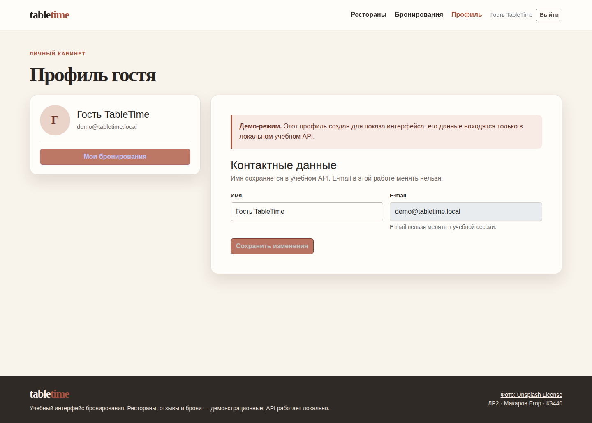
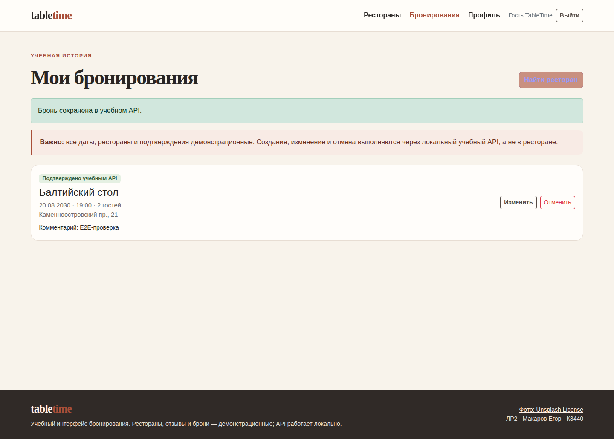
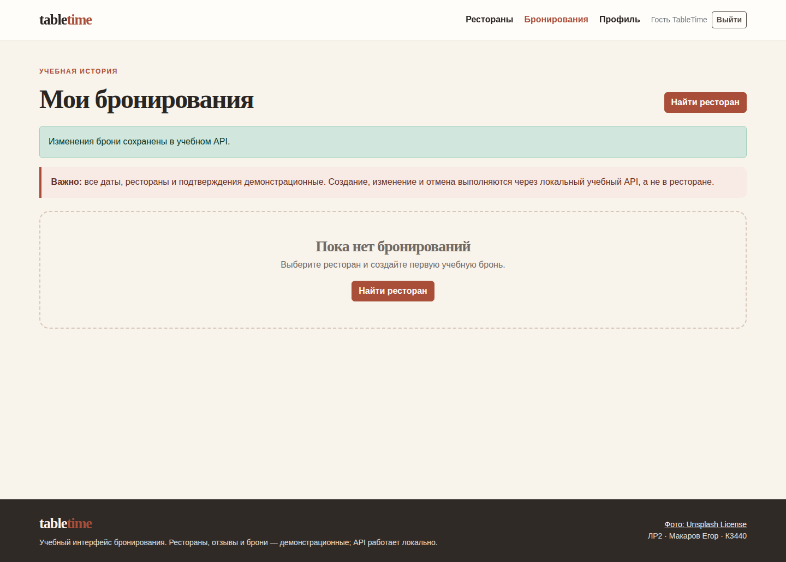

# Лабораторная работа 2 — взаимодействие с внешним API

**Студент:** Макаров Егор  
**Группа:** К3440  
**Вариант:** приложение для бронирования столиков в ресторанах  
**Приложение:** TableTime

## Цель работы

Цель работы — перенести интерфейс TableTime из ЛР1 на реальное учебное HTTP-взаимодействие. Клиент должен получать демонстрационные данные ресторанов через `fetch`, а регистрация, вход, профиль и бронирования должны работать с локальным JSON Server, а не с данными в `localStorage`.

## Результат

ЛР2 находится в самостоятельной папке `lab2` и не ссылается на исходники или `node_modules` ЛР1. Она содержит Vite multipage-клиент на JavaScript, JSON Server `0.17.4`, Express middleware для аутентификации и контроля доступа, независимый `package-lock.json`, seed-данные и игнорируемую runtime-базу. При обычном запуске API доступен только на `127.0.0.1:3002`; веб-сервер использует порт `5172`, а Vite proxy передаёт клиентские запросы `/api/*` в API.

Клиент использует `fetch` в `src/api.js`. Функция API проверяет `response.ok`, поэтому HTTP-ошибки не воспринимаются как успешные ответы; сетевые ошибки также превращаются в понятное сообщение. На поиске, в истории броней и на детальной странице предусмотрены состояния **loading**, **error** и **empty**. Закрытые страницы профиля и бронирований перенаправляют неавторизованного посетителя на вход.

## Реализация API и безопасности

JSON Server является источником публичных демонстрационных коллекций `restaurants`, `menus` и `reviews`. Для аутентификации и бизнес-правил перед его router подключён Express middleware. Маршруты `POST /auth/register` и `POST /auth/login` возвращают учебный JWT, а пароль в базе записывается только как bcrypt-хеш. Клиент хранит лишь токен и безопасное публичное представление текущего пользователя.

API не публикует хеши паролей: формат `user` ограничен полями `id`, `name`, `email`, `isDemo` и `createdAt`. Маршрут `/users` намеренно отсутствует и возвращает `404`. Все операции `/bookings` требуют заголовок `Authorization: Bearer <token>`. Список броней отбирается по `userId` из токена, а чтение, изменение или удаление записи другого пользователя возвращают `404`; существование чужой записи не раскрывается. Публичные коллекции доступны только для `GET`, а их изменение получает `405`.

Полный контракт путей, форматов и статусов находится в [API.md](API.md). В файле `api/seed.json` находятся только явно демонстрационные рестораны, отзывы и аккаунт. Первый запуск копирует seed в `api/runtime/db.json`; runtime-файл исключён из Git, как и `node_modules` и `dist`.

## Пользовательские возможности

Поиск ресторанов, фильтры кухни, района и цены, карточка ресторана, меню и отзывы получают данные из API. Регистрация и вход работают с сервером. Профиль получает и обновляет имя по `GET` и `PATCH /auth/me`. Бронирование создаётся через `POST /bookings`, на странице истории его можно изменить через `PATCH /bookings/:id` и отменить через `DELETE /bookings/:id`. Модальное окно брони сохраняет фокус и не имитирует отправку заявки ресторану: в интерфейсе и API прямо указано, что это учебные данные.

Фотографии интерьеров скопированы из завершённой ЛР1 в независимую папку `assets/`; имена исходных файлов содержат `unsplash`, а ссылка на условия [Unsplash License][3] присутствует в футере приложения. Они используются как иллюстрации демонстрационного интерфейса, а не как сведения о реальных ресторанах.

## Запуск

Из папки работы выполните следующие команды:

```bash
cd "labs/К3440/Макаров Егор/lab2"
npm ci
npm run dev
```

После этого веб-интерфейс доступен по `http://localhost:5172`, а локальный mock API — по `http://127.0.0.1:3002`. Для возврата демонстрационной базы в исходное состояние следует выполнить:

```bash
npm run reset-db
```

Для production-сборки используется `npm run build`. Папка `dist` намеренно не добавляется в репозиторий.

## Проверка

Проверки выполнены после реализации, в папке ЛР2. Результаты ниже относятся к реально запущенным командам.

| Команда | Результат |
|---|---|
| `npm ci --dry-run` | Успешно: lockfile согласован с `package.json`. |
| `npm test` | Успешно: 7 из 7 API-тестов. Проверены публичное чтение, отсутствие `/users`, bcrypt-хеш, безопасный ответ регистрации, неверный пароль, авторизация профиля, полный CRUD брони, запрет доступа к чужой записи, валидация и запрет изменения публичных коллекций. |
| `npm run build` | Успешно: Vite собрал все шесть HTML-страниц. |
| `npm run test:e2e` | Успешно: 2 из 2 браузерных сценариев Playwright. Проверены демо-вход, создание, изменение и отмена брони через интерфейс, а также redirect гостя со страницы броней на вход. |

Первоначальная попытка browser E2E выявила, что Chromium Playwright отсутствовал в sandbox. Браузер был установлен командой `npx playwright install chromium`; после этого итоговый запуск `npm run test:e2e` прошёл без ошибок. Это не является зависимостью приложения: для воспроизведения E2E в чистом окружении Playwright также потребуется его браузер.

## Скриншоты реального E2E-сценария

На первом снимке показан профиль после реального входа демо-пользователя в локальный API.



На втором снимке отражён результат создания брони через модальную форму: запись «E2E-проверка» получена из API и отображена в истории.



На третьем снимке показано пустое состояние истории после изменения и отмены этой же записи.



## Ограничения и вывод

TableTime — локальный учебный mock, а не production-сервис. JWT-secret встроен только для локального запуска, демонстрационный пароль известен из интерфейса, TLS и восстановление пароля не реализованы. API по умолчанию привязан к localhost, отправка реальных бронирований, платежей, писем и обработка реальных персональных данных отсутствуют. Эти ограничения намеренно видны пользователю.

Цель работы достигнута: копия ЛР1 перенесена на JSON Server и `fetch`; закрытые данные и бронирования защищены серверной проверкой токена и владения; клиент корректно обрабатывает успешные, пустые, ошибочные и загружаемые состояния. Автоматические API- и браузерные проверки подтверждают полный основной сценарий.

## Источники

[1]: https://github.com/typicode/json-server/tree/v0.17.4 "JSON Server v0.17.4"
[2]: https://developer.mozilla.org/en-US/docs/Web/API/Fetch_API "Fetch API — MDN Web Docs"
[3]: https://unsplash.com/license "Unsplash License"
