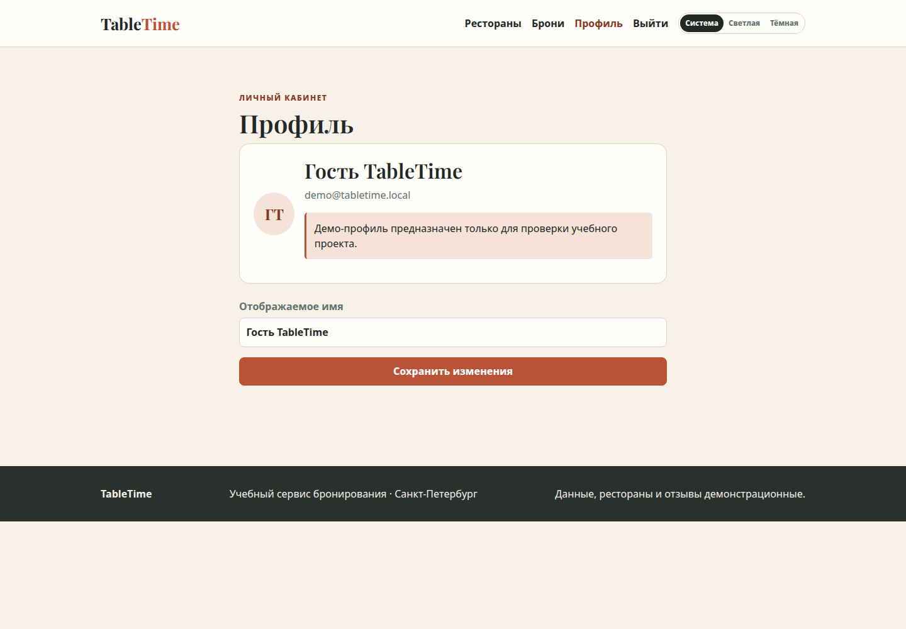
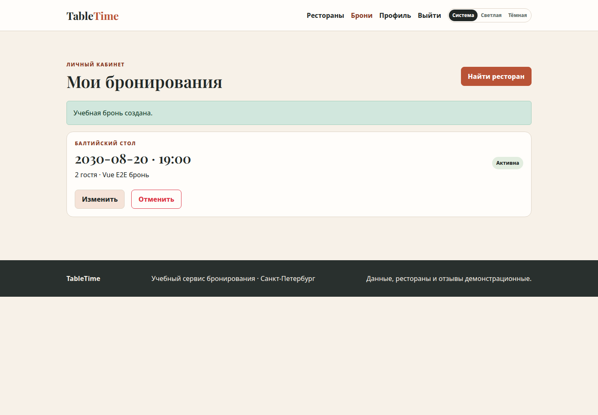
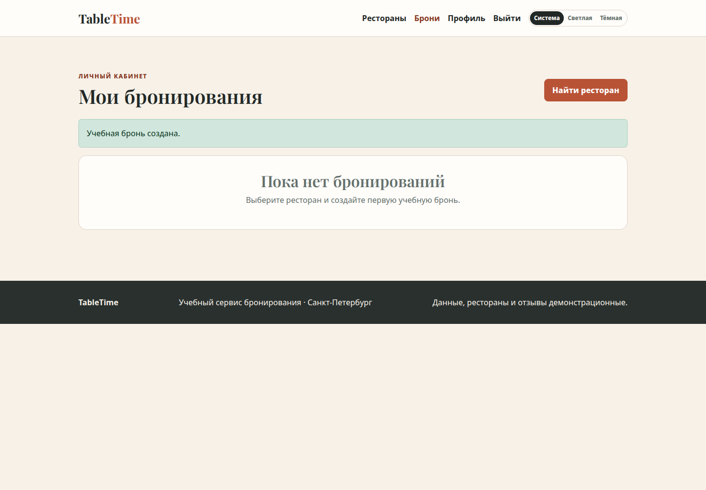
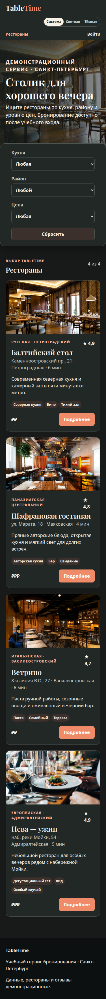

# Лабораторная работа 3 — TableTime: Vue SPA

**Студент:** Макаров Егор

**Группа:** К3440

**Вариант:** сервис бронирования столиков в ресторанах TableTime

## Цель

Перенести учебное приложение TableTime из ЛР2 на **Vue 3** и сохранить сценарии поиска ресторанов, локальной регистрации и входа, профиля и управления бронированиями. В результате создано самостоятельное SPA с Vue Router, axios и локальным JSON Server. Все рестораны, отзывы, профили и бронирования являются демонстрационными; сервис не передаёт данные ресторанам и не принимает реальные заказы.

## Запуск

Требуется Node.js и npm. Из корня репозитория выполняются следующие команды:

```bash
# Выполнить из корня клонированного репозитория:
cd "labs/К3440/Макаров Егор/lab3"
npm ci
npm run dev
```

Vite открывает клиент на `http://localhost:5173`, а учебный API работает только на `http://127.0.0.1:3002`. Команда `npm run reset-db` возвращает локальную runtime-базу к [seed-данным](api/seed.json). Runtime-файл `api/runtime/db.json` намеренно исключён из Git, как и `node_modules` и `dist`.

Для демонстрации без ручного ввода предусмотрен профиль `demo@tabletime.local` с указанным интерфейсом учебным паролем. Это известная демонстрационная учётная запись, поэтому для неё нельзя использовать настоящий пароль.

## Реализация SPA

Точка входа [src/main.js](src/main.js) создаёт Vue-приложение и подключает [router](src/router/index.js). В маршрутах есть поиск, страница ресторана, вход, регистрация, профиль, бронирования и страница 404. Страницы `/profile` и `/bookings` имеют `meta.requiresAuth`; глобальный `beforeEach` перенаправляет гостя на `/login` и сохраняет исходный маршрут в query-параметре `next`. Для уже вошедшего пользователя страницы входа и регистрации недоступны. Такой вариант соответствует модели navigation guards Vue Router: guard может вернуть новое location и тем самым инициировать redirect.[1]

Интерфейс разделён на повторно используемые [BookingForm.vue](src/components/BookingForm.vue), [RestaurantCard.vue](src/components/RestaurantCard.vue), [StatusPanel.vue](src/components/StatusPanel.vue), [ThemeSwitcher.vue](src/components/ThemeSwitcher.vue) и [AppIcon.vue](src/components/AppIcon.vue). Страницы находятся в [src/views](src/views), а корневой layout — в [App.vue](src/App.vue). Форма бронирования эмитирует проверенный набор значений родительскому экрану, а карточка получает ресторан через props.

Сетевой слой расположен в [src/composables/useApi.js](src/composables/useApi.js). Он создаёт экземпляр axios с базовым путём `/api`, тайм-аутом 9 секунд и перехватчиками. Запросы, требующие входа, получают `Authorization: Bearer …`; ответ с `401` очищает сессию. Ошибки HTTP и ошибки сети приводятся к общему `ApiError`, после чего экран показывает понятное состояние ошибки и кнопку повторной загрузки. Это согласуется с подходом axios, в котором неуспешный запрос отклоняет Promise, а информация об HTTP-ответе находится в объекте ошибки.[2]

[useSession.js](src/composables/useSession.js) хранит реактивное состояние сессии, восстанавливает профиль через `/auth/me` и очищает недействительный токен. [useTheme.js](src/composables/useTheme.js) реализует варианты «Светлая», «Тёмная» и «Система», сохраняет выбор в `localStorage` и слушает изменение `prefers-color-scheme`. В [src/styles.css](src/styles.css) сохранены CSS-переменные темы, адаптивная сетка и режим уменьшенного движения.

После проверки актуальных правок доступности ЛР2 в ЛР3 перенесены их применимые аналоги: ссылка пропуска к `<main>`, именованная навигация, видимый focus, семантический список тегов вместо набора декоративных `span`, подписи полей, `role="status"`/`role="alert"` для состояний и доступные текстовые альтернативы изображений. Эта проверка также обнаружила пересечение имени списка тегов с фильтром «Кухня»; имя списка сделано нейтральным — «Особенности ресторана».

## Учебный API

[api/server.mjs](api/server.mjs) запускает JSON Server 0.17.4 с Express middleware. Seed содержит рестораны, меню, отзывы и демонстрационного пользователя, а рабочая копия создаётся отдельно. Реализованы `POST /auth/register`, `POST /auth/login`, `GET/PATCH /auth/me`, публичное чтение ресторанов/меню/отзывов и закрытый CRUD `/bookings`. Сервер хеширует пароль bcryptjs, выдаёт JWT и проверяет токен и `ownerId` брони. Поэтому пользователь не может получить, изменить или удалить чужую бронь, а хеш пароля не попадает в API-ответ. Базовый механизм mock REST-ресурсов предоставлен закреплённой версией JSON Server.[3]

## Проверка

Финальный прогон выполнен 24 сентября 2026 года в каталоге ЛР3 после первого коммита исходников. Использовались Node.js `v22.13.0` и npm `10.9.2`.

| Команда | Результат |
|---|---|
| `npm ci` | **PASS**: установлено 201 пакетов, `npm audit` сообщил `0 vulnerabilities`; единственное предупреждение — устаревший транзитивный `connect-pause@0.1.1`. |
| `npm run build` | **PASS**: Vite 6.4.3 собрал production-вариант, 97 модулей преобразованы. |
| `npm test` | **PASS, 6/6**: проверены отсутствие хешей и публичной коллекции пользователей, bcrypt при регистрации, отказ при неверном пароле, защита профиля, создание/изменение/отмена брони, изоляция чужой брони, валидация и read-only публичных данных. |
| `npm run test:e2e` | **PASS, 4/4**: проверены guard и возврат на исходный маршрут, динамические фильтры и сброс, демо-вход, создание/изменение/отмена брони, сохранение темы, реакция системной темы и отсутствие горизонтального overflow на ширине 375 px. |

## Скриншоты реального E2E

Снимки сделаны Playwright во время E2E-сценария. Они относятся к локальному учебному API и демонстрационным данным.









## Ограничения и вывод

TableTime предназначен только для учебной демонстрации. API по умолчанию привязан к loopback, JWT-secret и демо-пароль не являются production-секретами, TLS, сброс пароля, платежи, письма и реальные бронирования не реализованы. Фотографии поставлены как локальные файлы [public/assets](public/assets) с обозначением `unsplash` в именах; индивидуальные страницы фотографов в исходниках не зафиксированы, поэтому при публичном использовании необходимо отдельно подтвердить атрибуцию и лицензию. Справочная лицензия Unsplash приведена ниже.[4]

Цель достигнута: приложение мигрировано на Vue 3 SPA с Router, route guards, axios, компонентами и composables; локальный API сохраняет серверную авторизацию и изоляцию данных. Финальная чистая установка, сборка, API-тесты и браузерные E2E прошли успешно.

## Источники

[1]: https://router.vuejs.org/guide/advanced/navigation-guards.html "Vue Router — Navigation Guards"
[2]: https://axios-http.com/docs/handling_errors "Axios — Handling Errors"
[3]: https://github.com/typicode/json-server/tree/v0.17.4 "JSON Server v0.17.4"
[4]: https://unsplash.com/license "Unsplash License"
